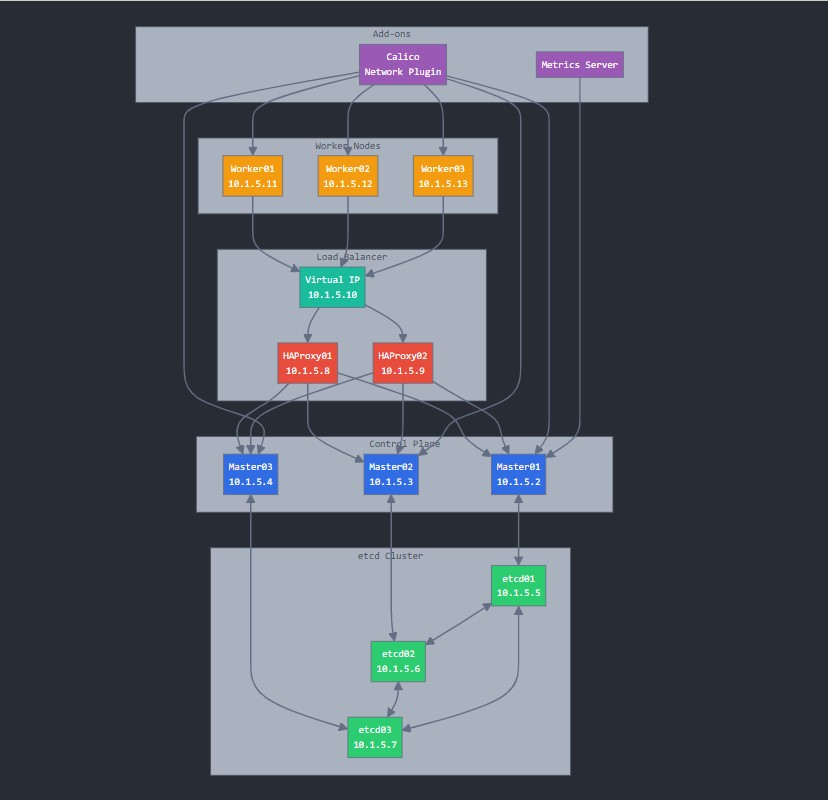
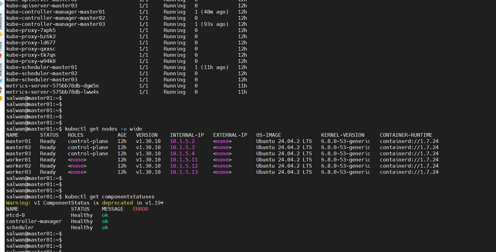
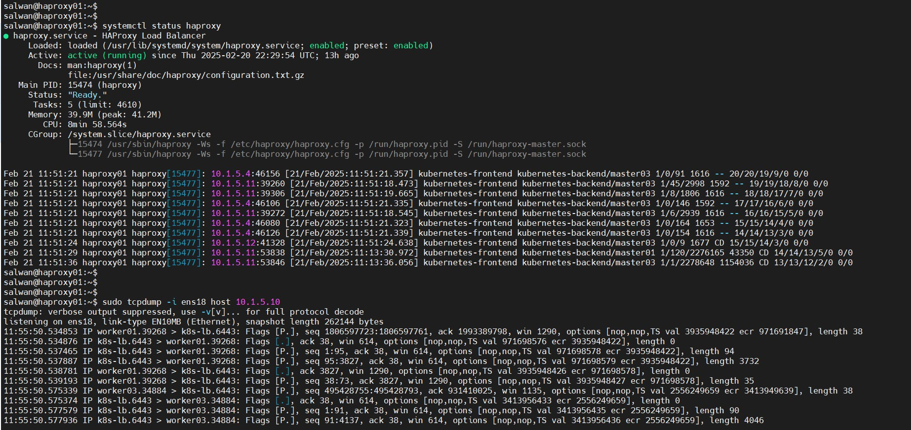
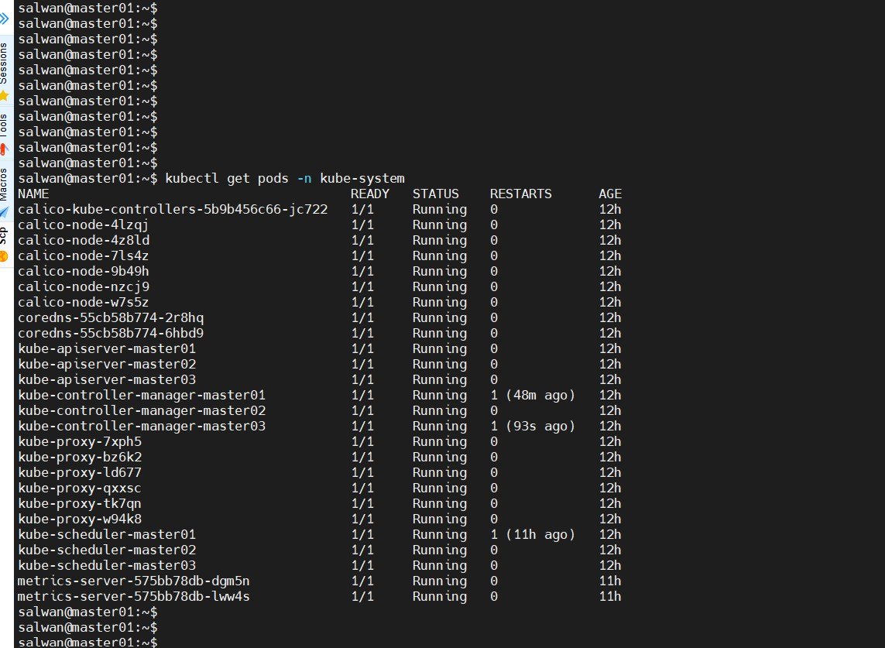

# Kubernetes High-Availability Cluster



## Project Overview

This repository contains complete configuration files and setup instructions for deploying a production-grade high-availability Kubernetes cluster with:

- 3 Control plane nodes
- 3 External etcd nodes 
- 2 HAProxy load balancers with Keepalived for automatic failover
- 3 Worker nodes
- Calico CNI for pod networking

## Architecture

The cluster follows best practices for high availability:

| Component | Nodes | IP Range | Purpose |
|-----------|-------|----------|---------|
| Control Plane | master01-03 | 10.1.5.2-4 | API Server, Controller, Scheduler |
| etcd Cluster | etcd01-03 | 10.1.5.5-7 | Distributed key-value store |
| Load Balancers | haproxy01-02 | 10.1.5.8-9 (VIP: 10.1.5.10) | API server load balancing |
| Worker Nodes | worker01-03 | 10.1.5.11-13 | Application workloads |

## Implementation Details

### Prerequisites
- Ubuntu 24.04 LTS on all nodes
- Minimum 2 CPU / 4GB RAM for each node (more for production)
- SSH access to all nodes
- Static IP address configuration

### Key Features
- External etcd cluster for enhanced reliability
- API server load balancing with HAProxy
- Virtual IP with automatic failover via Keepalived
- Calico CNI for pod networking and network policy
- Metrics Server for resource monitoring

## Deployment Guide

See the [Installation Guide](./docs/installation.md) for detailed step-by-step instructions.

Quick start:
```bash
# 1. Clone the repository
git clone https://github.com/YOUR-USERNAME/kubernetes-ha-cluster.git
cd kubernetes-ha-cluster

# 2. Modify configuration files with your IP addresses
# Edit configs/hosts.conf, configs/haproxy.cfg, etc.

# 3. Run the setup script
chmod +x scripts/setup/deploy-cluster.sh
./scripts/setup/deploy-cluster.sh
```

## Repository Structure

```
.
├── configs/                  # Configuration files
│   ├── etcd/                 # etcd configuration
│   ├── haproxy/              # HAProxy configuration
│   ├── keepalived/           # Keepalived configuration
│   └── kubeadm/              # Kubeadm configuration
├── docs/                     # Documentation
│   ├── installation.md       # Installation guide
│   ├── testing.md            # Testing procedures
│   └── troubleshooting.md    # Common issues and solutions
├── images/                   # Screenshots and diagrams
├── scripts/                  # Automation scripts
│   ├── backup/               # etcd backup scripts
│   ├── monitoring/           # Monitoring setup
│   └── setup/                # Cluster setup scripts
└── README.md                 # This file
```

## Screenshots





## Testing & Validation

The [Testing Guide](./docs/testing.md) provides procedures to validate the high-availability features:
- Control plane node failure scenarios
- Load balancer failover testing
- etcd failure recovery
- Worker node recovery

## Maintenance

The cluster includes several maintenance helpers:
- Automated etcd backup script (see `scripts/backup/`)
- Node drain/cordon helpers for maintenance
- Certificate rotation procedures

## License

MIT

## Contributing

Contributions welcome! Please see [CONTRIBUTING.md](./CONTRIBUTING.md) for details.
